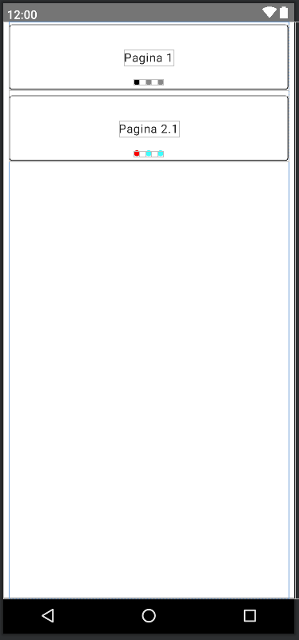

# jetpackcompose
Este repo alberga una serie de composables que, de un modo u otro me son o han sido necesarios en el desarrollo de mis apps, otros simplemente han sido un reto autoimpuesto para probar nuevas cosillas y/o probar nuevas tecnologías.

## Instalación

```
implementation 'io.github.afalabarce:jetpackcompose:1.7.6'
```

Si crees que estoy haciendo un buen trabajo y me merezco un café, puedes invitarme haciéndome un 
[PayPalMe!](https://www.paypal.com/paypalme/afalabarce) o [](https://ko-fi.com/R5R4NB8VV)

## Uso

Contiene once composables (por ahora) útiles para el día a día:  

1. **CalendarDropDown**, que nos genera el típico desplegable con un calendario en el que seleccionar una fecha. Soporta el botón Hoy, para posicionarnos en la fecha actual. 
Se puede ver un pequeño video de ejemplo en [Youtube](https://www.youtube.com/watch?v=r2m9KNps4NY) (realizado para Compose4Desktop, pero totalmente compatible con Compose Android). 
2. **Calendar**, relacionado con el primero (que nos permite colocar un calendario directamente en nuestra app.
3. **SwipeableCard**, es un Card, que nos permite agregarle acciones en Swipe horizontal, tanto a izquierda como a derecha.   
 Debido a errores extraños he tenido que establecer en el composable el mapAnchors (el que se encarga de decirle al composable cuanto debe desplazar el Card a izquierda o derecha) desde la propia llamada.
 Se puede ver un pequeño video de este Composable en [Youtube](https://www.youtube.com/watch?v=tBkPXBNOzfw).
 Un ejemplo de llamada de SwipeableCard, sería el siguiente:

 ```kotlin
 // Función que nos devuelve todas las posibles acciones de un objeto Task, en función de sus posibilidades
 private fun taskActions(task: Task): Array<SwipeAction> {
     return arrayOf(
         SwipeAction(
             order = if (task.task.isOpen && !task.isWorking) 0 else -1,
             key = "StartTimeLapse",
             title = "Iniciar",
             imageVector = Icons.Filled.PunchClock,
             color = DarkBlue,
             tint = White,
             true
         ),
         SwipeAction(
             order = if (task.task.isOpen && task.isWorking) 0 else -1,
             key = "ShowTimeLapse",
             title = "Ver",
             imageVector = Icons.Filled.PunchClock,
             color = DarkGreen,
             tint = White,
             true
         ),
         SwipeAction(
             order = if (task.task.isOpen) 0 else -1,
             key = "Modify",
             title = "Editar",
             imageVector = Icons.Filled.Edit,
             color = DarkGreen,
             tint = White,
             false
         ),
         SwipeAction(
             order = if (!task.withTimeLapse) 1 else -1,
             key = "Delete",
             title = "Borrar",
             imageVector = Icons.Filled.Delete,
             color = Red,
             tint = White,
             false
         ),
         SwipeAction(
             order = if (task.task.isOpen) 2 else -1,
             key = "End",
             title = "Fin",
             imageVector = Icons.Filled.Close,
             color = DarkBlue,
             tint = White,
             false
         ),
         SwipeAction(
             //order = if (!task.task.isOpen || (task.withTimeLapse && !task.isWorking)) 2 else -1,
             order = if (task.withTimeLapse && !task.isWorking) 2 else -1,
             key = "ShowResume",
             title = "Resumen",
             imageVector = Icons.Filled.Checklist,
             color = DarkOrange,
             tint = White,
             true
         )
     ).filter { x -> x.order >= 0 }.toTypedArray()


     // Función que pintaría el SwipeableCard, se integraría por ejemplo en un LazyColumn
     fun TaskItem(task: Task) {
         val tasksActions = this.taskActions(task)
         SwipeableCard(
             modifier = Modifier
                 .fillMaxWidth()
                 .height(96.dp)
                 .padding(3.dp),
             shape = MaterialTheme.shapes.small,
             anchors = getAnchorMap(LocalDensity.current, 82.dp, tasksActions),
             elevation = 3.dp,
             buttonWidth = 82.dp,
             border = BorderStroke(1.dp, color = Color.LightGray),
             swipeActions = tasksActions
         ) {
             Row(
                 modifier = Modifier
                     .fillMaxWidth()
                     .height(96.dp)
             ) {
                 Column(
                     modifier = Modifier.fillMaxHeight(),
                     verticalArrangement = Arrangement.Center
                 ) {
                     Box(modifier = Modifier.size(64.dp)) {
                         Icon(
                             imageVector = if (task.isWorking) Icons.Filled.PunchClock else Icons.Filled.Task,
                             contentDescription = null,
                             modifier = Modifier.size(64.dp),
                             tint = if (task.task.isOpen && !task.isWorking) DarkGreen else if (task.isWorking) DarkBlue else Color.Red
                         )

                         if (task.withTimeLapse) {
                             Box(
                                 modifier = Modifier.size(28.dp).shadow(
                                     elevation = 1.dp,
                                     shape = RoundedCornerShape(5.dp)
                                 ).background(DarkOrange).align(Alignment.BottomEnd),
                                 contentAlignment = Alignment.Center
                             ) {
                                 Icon(
                                     imageVector = Icons.Filled.PunchClock,
                                     contentDescription = null,
                                     modifier = Modifier.size(24.dp),
                                     tint = White
                                 )
                             }

                         }
                     }
                 }
                 Column(modifier = Modifier.fillMaxSize()) {
                     Text(text = task.task.title, style = MaterialTheme.typography.body1)
                     Text(
                         text = "${stringResource(R.string.project_label)} ${task.task.project}",
                         style = MaterialTheme.typography.caption
                     )
                     Text(
                         text = "${stringResource(R.string.creation_date_title)} ${
                             task.task.creationDate.format(
                                 "dd/MM/yyyy HH:mm"
                             )
                         }",
                         style = MaterialTheme.typography.body2
                     )
                 }
             }
         }
     }
 }
        
 ```

4. **CircularProgressIndicator**, que permite en una única llamada establecer un background al toroide del progreso según va decrementando. Además agrega un campo content que nos permite meter un composable en el interior.
5. **LabelledSwitch**, que nos permite utilizar un Switch con su label a la izquierda (además de un leadingIcon).
6. **NoPaddingAlertDialog**, es un AlertDialog Sin paddings, el cual nos permite personalizar muchísimo la apariencia de nuestros alertdialog.
7. **DrawCanvas**, es un Canvas de dibujo que nos permite dibujar líneas y agregar una marca de agua, delante o detrás de los trazos, a fin de que por ejemplo, podamos emular una firma con un sello. 
 Se puede ver un pequeño vídeo de ejemplo en [Youtube](https://www.youtube.com/watch?v=0pMQPTLKKuQ)
8. **BottomSheetDialogMaterial3**, es un BottomSheetDialog básico para Material3. Se ha implementado debido a la ausencia de un BottomSheetDialog propio para Jetpackcompose material3. Su definición es la siguiente:
```kotlin
fun BottomSheetDialogMaterial3(
    isVisible: Boolean,
    slideTimeInMillis: Int = 800,
    backDropColor: Color = Color(0x44444444),
    dialogShape: Shape = MaterialTheme.shapes.medium.copy(
        bottomEnd = CornerSize(0),
        bottomStart = CornerSize(0)
    ),
    dialogElevation: CardElevation = CardDefaults.cardElevation(defaultElevation = 4.dp),
    dialogBorderStroke: BorderStroke? = BorderStroke(2.dp, MaterialTheme.colorScheme.onBackground),
    cardColors: CardColors = CardDefaults.cardColors(contentColor = MaterialTheme.colorScheme.background),
    onDismissRequest: () -> Unit = {},
    content: @Composable () -> Unit
) {
    // Aquí tú código
}
```
9. **SvgPickerSelector**, nos permite, mediante un FileWatcher monitorizar una serie de carpetas en la 
búsqueda de ficheros SVG, a fin de poder seleccionar uno de ellos para cargarlos en un AsyncImage. 
Este ha obligado a añadir una referencia a la libería de imágenes [Coil para compose](https://coil-kt.github.io/coil/compose/)). 
En la captura siguiente se puede ver en conjunto con BottomSheetDialogMaterial3.  


10. **CardPager**, es un Card cuya principal característica es que no tiene un content como tal, sino que se le 
agrega un array de composables que serán los contenidos de dicho Card. Su firma es la siguiente:

```kotlin
fun CardPager(
    modifier: Modifier,
    shape: Shape = MaterialTheme.shapes.medium,
    backgroundColor: Color = MaterialTheme.colors.surface,
    contentColor: Color = contentColorFor(backgroundColor),
    showPagerIndicator: Boolean = true,
    pagerIndicatorActiveColor: Color = Color.Black,
    pagerIndicatorInactiveColor: Color = Color.Gray,
    border: BorderStroke? = null,
    elevation: Dp = 1.dp,
    pageComposables: Array<@Composable () -> Unit>
)
```

A continuación veamos un ejemplo de uso, con lo que sería la clásica función Preview:

```kotlin
@Preview(showSystemUi = true)
@Composable
private fun CardPagerPreview(){
    MaterialTheme{
        Surface{
            Column(modifier = Modifier
                .fillMaxSize()
                .padding(horizontal = 8.dp),
                verticalArrangement = Arrangement.Top) {
                CardPager(
                    modifier = Modifier
                        .fillMaxWidth()
                        .height(96.dp)
                        .padding(vertical = 4.dp),
                    border = BorderStroke(1.dp, Color.Black),
                    pageComposables = arrayOf(
                        {
                            Text(text = "Page 1.1")
                        },
                        {
                            Text(text = "Page 1.2")
                        },
                        {
                            Text(text = "Page 1.3")
                        }
                    )
                )

                CardPager(
                    modifier = Modifier
                        .fillMaxWidth()
                        .height(96.dp)
                        .padding(vertical = 4.dp),
                    border = BorderStroke(1.dp, Color.Black),
                    pagerIndicatorActiveColor = Color.Red,
                    pagerIndicatorInactiveColor = Color.Cyan,
                    pageComposables = arrayOf(
                        {
                            Text(text = "Page 2.1")
                        },
                        {
                            Text(text = "Page 2.2")
                        },
                        {
                            Text(text = "Page 2.3")
                        }
                    )
                )
            }
        }
    }
}
```

Cuyo resultado, sería el siguiente:



11. **FlipCard**, es un composable ideal para implementar una clásica Card con dos caras, las cuales rotan tanto sobre el eje vertical como 
horizontal, de este modo podemos aplicar efectos de visualización de rotación de elementos ocultos (por ejemplo, la rotación de una tarjeta). 
Este composable ha sido extraido del siguiente [GIST](https://gist.github.com/fvilarino/92d03574d21755739ce178c5178393ec#file-flip_card_06-kt).

La firma del composable FlipCard es la siguiente (demás de los enumerados que indican la cara a mostra y el tipo de rotación a aplicar ):

```kotlin
enum class CardFace {
    Front,
    Back
}

enum class RotationAxis {
    AxisX,
    AxisY,
}

fun FlipCard(
    cardFace: CardFace,
    onClick: (CardFace) -> Unit,
    modifier: Modifier = Modifier,
    axis: RotationAxis = RotationAxis.AxisY,
    back: @Composable () -> Unit = {},
    front: @Composable () -> Unit = {},
)

```

12. **OrbitalMenu**, es un composable ideal para dar un aspecto diferente a nuestras opciones de menú, nos permite mostrar de forma muy visual 
distintas opciones organizadas en torno a un nucleo y una serie de órbitas, en las cuales, podremos ubicar composables (Satélites)  basándonos
en los puntos cardinales. En [Youtube](https://www.youtube.com/shorts/ryzLj3UYS-Y) se puede ver un ejemplo de su funcionamiento.
 Un ejemplo de implementación sería el siguiente (con satélites en cada punto cardinal - TLDR;)

```kotlin

var isExpanding by remember {
        mutableStateOf(false)
    }
    var isFirstExpanded by remember {
        mutableStateOf(false)
    }
    val context = LocalContext.current

    OrbitalMenu(
        modifier = Modifier.fillMaxSize(),
        isExpanded = isExpanding,
        core = {
            Card(
                modifier = Modifier
                    .size(64.dp)
                    .align(Alignment.Center)
            ) {
                Icon(
                    imageVector = Icons.Default.Menu,
                    contentDescription = null,

                    )
            }
        },
        satellites = listOf(
            Satellite(
                satelliteKey = "North",
                satellitePosition = SatellitePosition.NORTH,
                orbit = 1,
            ) {
                Text(
                    text = "N",
                    textAlign = TextAlign.Center,
                    style = MaterialTheme.typography.headlineLarge,
                    modifier = Modifier
                        .size(48.dp)
                        .clip(MaterialTheme.shapes.medium)
                        .background(Color.Red)
                )
            },
            Satellite(
                satelliteKey = "East",
                satellitePosition = SatellitePosition.EAST,
                orbit = 2,
            ) {
                Text(
                    text = "E",
                    textAlign = TextAlign.Center,
                    style = MaterialTheme.typography.headlineLarge,
                    modifier = Modifier
                        .size(48.dp)
                        .clip(MaterialTheme.shapes.medium)
                        .background(Color.Red)
                )
            },
            Satellite(
                satelliteKey = "South",
                satellitePosition = SatellitePosition.SOUTH,
                orbit = 2,
            ) {
                Text(
                    text = "S",
                    textAlign = TextAlign.Center,
                    style = MaterialTheme.typography.headlineLarge,
                    modifier = Modifier
                        .size(48.dp)
                        .clip(MaterialTheme.shapes.medium)
                        .background(Color.Red)
                )
            },
            Satellite(
                satelliteKey = "West",
                satellitePosition = SatellitePosition.WEST,
                orbit = 2,
            ) {
                Text(
                    text = "W",
                    textAlign = TextAlign.Center,
                    style = MaterialTheme.typography.headlineLarge,
                    modifier = Modifier
                        .size(48.dp)
                        .clip(MaterialTheme.shapes.medium)
                        .background(Color.Red)
                )
            },
            Satellite(
                satelliteKey = "North East",
                satellitePosition = SatellitePosition.NORTH_EAST,
                orbit = 3,
            ) {
                Text(
                    text = "NE",
                    textAlign = TextAlign.Center,
                    style = MaterialTheme.typography.headlineMedium,
                    modifier = Modifier
                        .size(48.dp)
                        .clip(MaterialTheme.shapes.medium)
                        .background(Color.Red)
                )
            },
            Satellite(
                satelliteKey = "South East",
                satellitePosition = SatellitePosition.SOUTH_EAST,
                orbit = 3,
            ) {
                Text(
                    text = "SE",
                    textAlign = TextAlign.Center,
                    style = MaterialTheme.typography.headlineMedium,
                    modifier = Modifier
                        .size(48.dp)
                        .clip(MaterialTheme.shapes.medium)
                        .background(Color.Red)
                )
            },
            Satellite(
                satelliteKey = "South West",
                satellitePosition = SatellitePosition.SOUTH_WEST,
                orbit = 3,
            ) {
                Text(
                    text = "SW",
                    textAlign = TextAlign.Center,
                    style = MaterialTheme.typography.headlineMedium,
                    modifier = Modifier
                        .size(48.dp)
                        .clip(MaterialTheme.shapes.medium)
                        .background(Color.Red)
                )
            },
            Satellite(
                satelliteKey = "North West",
                satellitePosition = SatellitePosition.NORTH_WEST,
                orbit = 3,
            ) {
                Text(
                    text = "NW",
                    textAlign = TextAlign.Center,
                    style = MaterialTheme.typography.headlineMedium,
                    modifier = Modifier
                        .size(48.dp)
                        .clip(MaterialTheme.shapes.medium)
                        .background(Color.Red)
                )
            },
        ),
        onCorePositioned = {
            if (!isFirstExpanded){
                isExpanding = true
                isFirstExpanded = true
            }
       },
        onClickCore = { isExpanding = !isExpanding },
    ) { clickedSatellite ->
        Toast.makeText(context, clickedSatellite.satelliteKey, Toast.LENGTH_LONG).show()
    }

```

13. **ScaffoldWizard**, este composable es un Scaffold que implementa de forma sencilla el despliegue de 
un Wizard, indicando una serie de composables (cada apartado del Wizard), de este modo automatizamos la 
tarea de generación del típico asistente u onBoarding. Su firma es la siguiente:

```kotlin
fun ScaffoldWizard(
    modifier: Modifier = Modifier,
    topBar: @Composable () -> Unit = {},
    snackBarHost: @Composable () -> Unit = {},
    floatingActionButton: @Composable () -> Unit = {},
    previousButtonColors: ButtonColors = ButtonDefaults.buttonColors(),
    previousButtonShape: Shape = MaterialTheme.shapes.medium,
    previousButtonElevation: ButtonElevation? = null,
    previousButtonBorder: BorderStroke? = null,
    previousButtonContent: @Composable () -> Unit,
    nextButtonColors: ButtonColors = ButtonDefaults.buttonColors(),
    nextButtonShape: Shape = MaterialTheme.shapes.medium,
    nextButtonElevation: ButtonElevation? = null,
    nextButtonBorder: BorderStroke? = null,
    nextButtonContent: @Composable () -> Unit,
    finishButtonContent: @Composable () -> Unit,
    pagerIndicatorActiveColor: Color = MaterialTheme.colorScheme.primary,
    pagerIndicatorInactiveColor: Color = MaterialTheme.colorScheme.secondary,
    floatingActionButtonPosition : FabPosition = FabPosition . End,
    containerColor: Color = MaterialTheme.colorScheme.background,
    contentColor: Color = contentColorFor(containerColor),
    contentWindowInsets: WindowInsets = ScaffoldDefaults.contentWindowInsets,
    pages: List<@Composable () -> Unit>,
)
```
Como podemos apreciar, es altamente configurable, permitiendo definir composables para cualquier estado en el que se encuentre
nuestro asistente, así como personalizar su apariencia.

A continuación, se muestra un ejemplo de uso con cuatro composables como páginas:

```kotlin
ScaffoldWizard(
        modifier = Modifier.fillMaxSize(),
        topBar = { QualityAppTopAppBar() },
        previousButtonContent = { Text(text = stringResource(id = R.string.previous)) },
        nextButtonContent = { Text(text = stringResource(id = R.string.next)) },
        finishButtonContent = { Text(text = stringResource(id = R.string.finish)) },
        bottomBarPaddingValues = PaddingValues(horizontal = 16.dp, vertical = 8.dp),
        pages = listOf<@Composable () -> Unit>(
            { FirstOnboardingPage() },
            { SecondOnboardingPage() },
            { ThirdOnboardingPage() },
            { FourthOnboardingPage() },
        )
    )
```

14. **setConnectionAvailableContent**, este método es una extensión a ComponentActivity, el cual,
gracias a su integración con NetworkStatusTracker, es capaz de monitorizar el estado de conexión de la app
de forma continuada, emitiendo el estado con un Flow, durante el ciclo de vida de la app. 
**Este método sustituiría a setContent**, el cual implementa dentro de sí mismo.

```kotlin
fun ComponentActivity.setConnectionAvailableContent(content: @Composable (NetworkStatus) -> Unit){
    setContent {
        val networkStatusTracker by remember { mutableStateOf(NetworkStatusTracker(this)) }
        val connectionStatus by networkStatusTracker.networkStatus.collectAsStateWithLifecycle(NetworkStatus.Available)

        content(connectionStatus)
    }
}
```

Siendo NetworkStatus la siguiente sealed class:

```kotlin
sealed class NetworkStatus{
    object Available : NetworkStatus()
    object Unavailable : NetworkStatus()
}
```

Por tanto su uso en una activity sería: 

```kotlin
@OptIn(ExperimentalAnimationApi::class)
    @SuppressLint("UnusedMaterial3ScaffoldPaddingParameter")
    override fun onCreate(savedInstanceState: Bundle?) {
        super.onCreate(savedInstanceState)
        setConnectionAvailableContent { networkStatus ->

        }
    }
```

Se agrega una nueva funcionalidad en relación a la descrita anteriormente, la cual permite que podamos obtener el 
estado en cualquier composable, usando LocalComposition, para ello en el onCreate de nuestra activity, en lugar de 
setContent utilizaremos **setUiContent**, permitiéndonos a partir de ahí, utilizar LocalNetworkStatus.current
para obtener el estado de conexión. Veámoslo con un ejemplo:

```kotlin
override fun onCreate(savedInstanceState: Bundle?) {
        super.onCreate(savedInstanceState)
        setUiContent { 
            MaterialTheme {
                // ...
            }
        }
    }
```

Y en cualquier composable:

```kotlin

@Composable fun MyNetworkingComposable(){
    val networkStatus = LocalNetworkStatus.current
    // ...
}

```

Además se agrega una nueva funcionalidad para LocalComposition llamada LocalBiometricCapabilities, la cual permite
determinar si tenemos capacidades de autenticación biométrica (ya sea huella, faceId o patrón, pin, etc), en cuyo caso podremos lanzar 
dicha autenticación. Su utilización sería la siguiente:

```kotlin
setUiContent {
  val bioCapabilities = LocalBiometricCapabilities.current

  if (bioCapabilities.canBiometricAuthentication){
    bioCapabilities.showBiometricPrompt(
      title = "Autenticación Biométrica",
      subTitle = if (bioCapabilities.canDevicePattern) 
          "Introduzca patrón" 
        else 
          "Use el sensor biométrico para autenticarse",
      description = "Esta aplicación se ha activado para autenticación biométrica / patrón de verificación, sólo podrá iniciar sesión utilizando uno de los métodos habilitados"
    ){ isSuccess, errorCode, errorString ->
      // blah blah blah
    }
  }
}
```

15. RadioGroup

RadioGroup nos permite crear de forma rápida y sencilla una agrupación de radiobuttons, en base a una lista de
elementos acotada, la principal ventaja es que la lista puede ser de cualquier tipo.

La definición del composable es la siguiente:
```kotlin
@Composable
inline fun <reified T>RadioButtonGroup(
    modifier: Modifier = Modifier,
    radioButtonLabel: @Composable (T) -> Unit = { },
    radioButtonValues: Array<T>,
    selectedValue: T?,
    borderStroke: BorderStroke? = null,
    dividerHeight: Dp = 4.dp,
    excludedValues: Array<T> = emptyArray(),
    radioButtonItemShape: Shape = MaterialTheme.shapes.medium,
    crossinline onCheckedChanged: (T) -> Unit
)
```

Como podemos ver, es altamente personalizable, pudiendo establecer diversos valores que van a facilitarnos
el despliegue del radiogroup, además, en caso de necesitarlo, disponemos una lista de exclusión en la que 
indicaremos elementos de la lista de valores que no deben ser generados.

Un ejemplo de uso sería el siguiente:
```kotlin
val texts = listOf("Elemento 1", "Elemento 2", "Elemento 3")
var selectedValue by remember { mutableStateOf("") }
Column (
    modifier = Modifier
        .fillMaxSize()
        .padding(16.dp)
){ 
    RadioButtonGroup(
        radioButtonValues = texts.toTypedArray(),
        selectedValue = selectedValue,
        onCheckedChanged = {selectedValue = it },
        radioButtonItemShape = RoundedCornerShape(16.dp),
        radioButtonLabel = {
            Text(text = "Cosa $it")
        }
    )
}
```

16. PermissionManager

Con PermissionManager podemos, de una forma muy simple, gestionar los permisos a utilizar en un composable
concreto, de este modo podremos (usando un BoxScope) actuar en caso de que tengamos algún permiso denegado,
por ejemplo, mostrando un diálogo, y a su vez marcando alguna situación que se ejecuta en el bloque general.

La firma de PermissionManager es la siguiente:

```kotlin
@Composable
fun PermissionManager(
    vararg permission: String,
    modifier: Modifier = Modifier,
    showDeniedIfNeeded: Boolean = true,
    onDenied: @Composable BoxScope.(Array<String>) -> Unit,
    onGranted: @Composable BoxScope.(Array<String>) -> Unit,
)
```

Como podemos apreciar, disponemos una colección variable para los permisos, seguido de varios parámetros que nos van a
permitir modificar el comportamiento de lo que se va a mostrar, así como lo que se pintará en el caso de que no tengamos aprobado
algún permiso:
- showDeniedIfNeeded, si está a true en el caso de que existan permisos sin aceptar, se ejecutará el bloque onDenied.
- onDenied, es el bloque de código que se ejecutará cuando alguno de los permisos solicitados no haya sido aceptado. Como parámetro
se devuelve la lista de permisos no aceptados.
- onGranted, es el bloque de código que se ejecutará siempre y cuando alguno de los permisos solicitados haya sido aceptado. **Este bloque de 
código NO se ejecutará si no hay al menos un permisos aceptado**.

Ejemplo de uso:

```kotlin
PermissionManager(
        Manifest.permission.INTERNET,
        Manifest.permission.ACCESS_COARSE_LOCATION,
        Manifest.permission.ACCESS_FINE_LOCATION,
        Manifest.permission.ACCESS_NETWORK_STATE,
        Manifest.permission.CALL_PHONE,
        modifier = Modifier,
        onDenied = { deniedPermissions ->
            Text(text = "Denied: ${deniedPermissions.joinToString("\n")}", modifier = Modifier.align(Alignment.Center))
        },
    ) { grantedPermissions ->
        Text(text = "Granted: ${grantedPermissions.joinToString("\n")}")
    }
```

## Otras Funcionalidades

Además se agrega una **extensión a Modifier** que permite poner un borde punteado a cualquier composable.

Para terminar, se ha agregado un Service, que permite utilizar ViewModels, ideal para que un servicio que tengamos implementado ejecute código de forma reactiva.

Espero que sea de ayuda, tanto didácticamente, como para su uso en tus apps...

Otro elemento que se puede obtener en el módulo es un ViewModelService, esto es, permite la creación de servicios que pueden suscribirse a ViewModels que nos van a permitir el acceso reactivo a bases de datos (por ejemplo).

Un ejemplo de uso de ViewModelService sería el siguiente:

```kotlin
@AndroidEntryPoint
class MyViewModelService: ViewModelService() {
    
    @Inject lateinit var viewModel: MyServiceViewModel
    
    //...
    
}

```

Gracias a [@xavijimenezmulet](https://github.com/xavijimenezmulet) se agrega un AmountVisualTransformation que permite 
establecer a un TextField un VisualTransformation que formatea el texto a un valor numérico
con separador de miles y decimales en función del Locale de la app.

## Authenticator

Con esta clase, puedes controlar fácilmente la creación y actualización de cuentas de usuario en el sistema de Android AccountManager

**Utilización**:

1. Crea tu propia clase YourOwnAuthenticatorService que hereda de Service.

   1.1. **Sobreescribe el método onBind, con tu propia implementación de Authenticator**:

```kotlin
        override fun onBind(intent: Intent?) = Authenticator(
               this,
               YourLoginActivity::class.java,
               R.string.your_account_type_name_resource_id,
               R.string.your_custom_message_on_single_account_error,
               R.string.your_custom_message_on_unsupported_account_error,
               R.string.your_custom_message_on_unsupported_token_error,
               R.string.your_custom_message_on_unsupported_features_error,
               true/false // true if only one account is allowed, false if app are designed to multiple accounts
        )
        
```
        
 2. **Crea tu propia actividad LoginActivity. Esta actividad necesitará capturar algunos extras de su intent**:

&nbsp;&nbsp;&nbsp;&nbsp;&nbsp;&nbsp;&nbsp;&nbsp;2.1. En el método onCreate, captura algunos de los extras del intent, que nos servirán para preparar la creación o actualización de la cuenta desde la app o desde el AccountManager:

&nbsp;&nbsp;&nbsp;&nbsp;&nbsp;&nbsp;&nbsp;&nbsp;&nbsp;&nbsp;&nbsp;&nbsp;&nbsp;&nbsp;&nbsp;&nbsp;2.1.1. Instancia tu propio Authenticator (como en el punto 1.1).

&nbsp;&nbsp;&nbsp;&nbsp;&nbsp;&nbsp;&nbsp;&nbsp;&nbsp;&nbsp;&nbsp;&nbsp;&nbsp;&nbsp;&nbsp;&nbsp;2.1.2. Carga los datos necesarios desde this.intent.extras:
                
```kotlin      
        this.fromApp = try{ (this.intent.extras!![Authenticator.ACTION_LOGIN_TYPE] as AuthenticatorLoginType) == AuthenticatorLoginType.App} catch(_: Exception){ false }
        this.loginUser = try{ this.intent.getSerializableExtra(Authenticator.KEY_ACCOUNT) as YourAppAccount<b>IUser</b> }catch(_: Exception { null }        
```     

&nbsp;&nbsp;&nbsp;&nbsp;&nbsp;&nbsp;&nbsp;&nbsp;&nbsp;&nbsp;&nbsp;&nbsp;&nbsp;&nbsp;&nbsp;&nbsp;2.1.3. Normalmente en un alta, limpiarás todos los campos de login.

&nbsp;&nbsp;&nbsp;&nbsp;&nbsp;&nbsp;&nbsp;&nbsp;&nbsp;&nbsp;&nbsp;&nbsp;&nbsp;&nbsp;&nbsp;&nbsp;2.1.4. Normalmente, si actualizas los datos de un usuario, lo harás cargando this.loginUser (extraido en 2.1.2)

&nbsp;&nbsp;&nbsp;&nbsp;&nbsp;&nbsp;&nbsp;&nbsp;&nbsp;&nbsp;&nbsp;&nbsp;&nbsp;&nbsp;&nbsp;&nbsp;2.1.5. Si el login ha sido correcto, guardaremos la cuenta en el sistema de cuentas de Android AccountManager:
            
```kotlin
       this.authenticator.saveUserAccount(this, R.string.your_account_type_name_resource_id, this.loginUser)            
```

3. **En tu AndroidManifest.xml se necesita hacer algunas cosas**

&nbsp;&nbsp;&nbsp;&nbsp;&nbsp;&nbsp;&nbsp;&nbsp;3.1. Agrega algunos permisos: 
```xml
    <Manifest>
             <uses-permission android:name="android.permission.MANAGE_ACCOUNTS" />
             <uses-permission android:name="android.permission.AUTHENTICATE_ACCOUNTS" />
             <uses-permission android:name="android.permission.USE_CREDENTIALS" />
             <uses-permission android:name="android.permission.GET_ACCOUNTS" />
             <uses-permission android:name="android.permission.READ_PROFILE" />
    </Manifest>
```

&nbsp;&nbsp;&nbsp;&nbsp;&nbsp;&nbsp;&nbsp;&nbsp;3.2. Agrega una referencia a tu servicio YourOwnAuthenticatorService en la sección <application>
     

```xml
            <service android:name=".auth.YourOwnAuthenticator" exported="true">
                 <intent-filter>
                      <action android:name="android.accounts.AccountAuthenticator" />
                  </intent-filter>

                  <meta-data
                      android:name="android.accounts.AccountAuthenticator"
                      android:resource="@xml/authenticator" />
            </service>
  
```
  
 4. **Agrega un recurso en la ruta xml/authenticator.xml, con el siguiente contenido**:
  
```xml
  
      <xml version="1.0" encoding="UTF-8" ?>

      <account-authenticator xmlns:android="http://schemas.android.com/apk/res/android"
              android:accountType="@string/your_account_type_name_resource_id"
              android:icon="@mipmap/ic_launcher"
              android:label="@string/app_name"
              android:smallIcon="@mipmap/ic_launcher">
      </account-authenticator>
        
```
 
**¡ Y ESTO ES TODO! GRACIAS por leerte todo este mamotreto :D**

